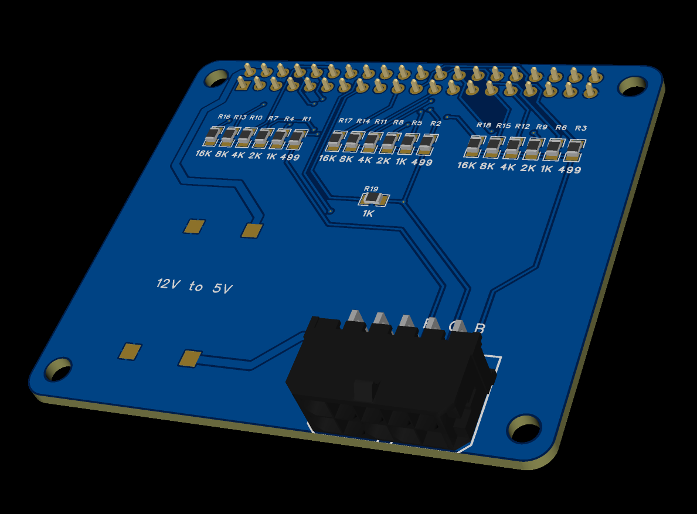
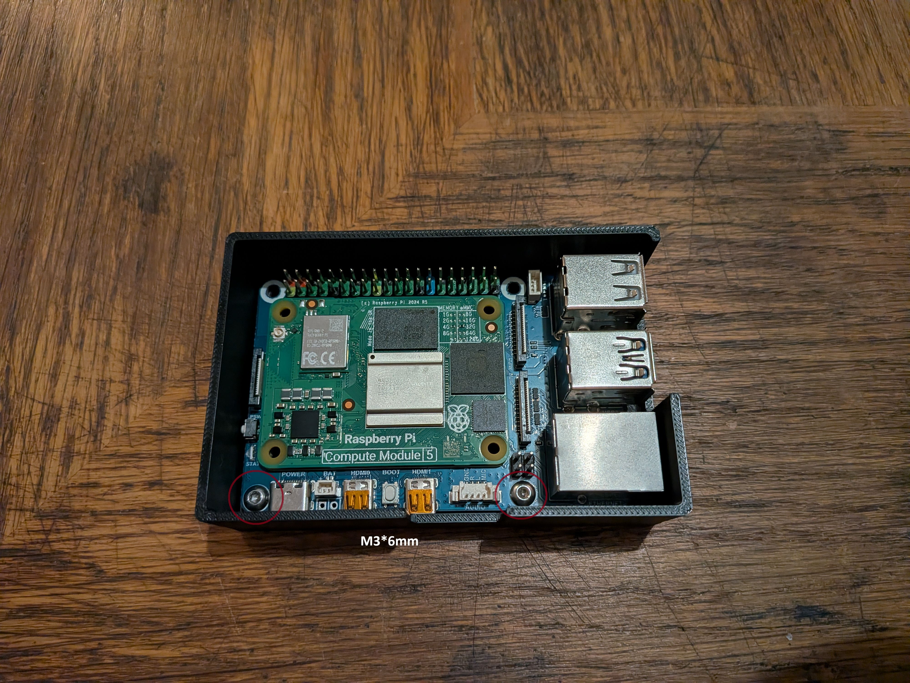
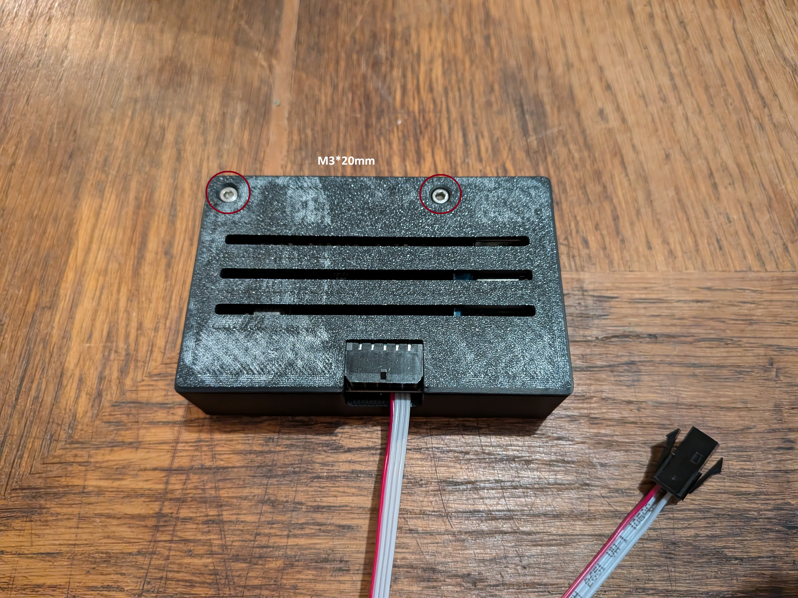
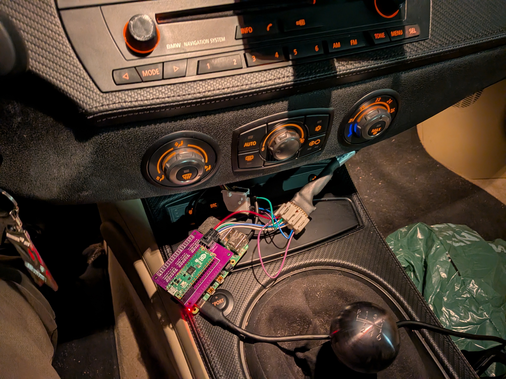
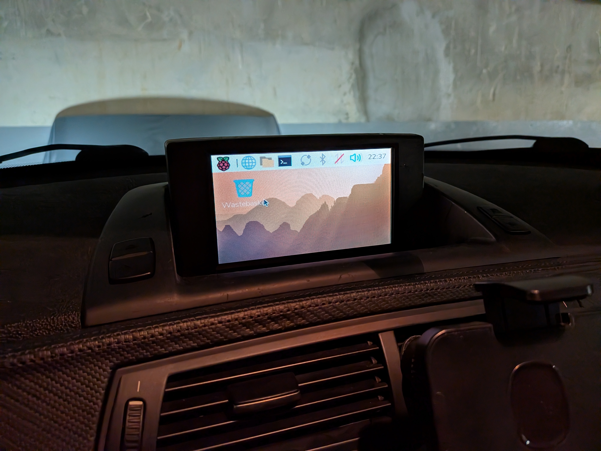

# Raspberry Pi 5 RGsB HAT

A Raspberry Pi 5 HAT PCB that generates analog RGsB (RGB Sync on Green) using the GPIO with RGB666 mode (VGA666).<br/>
Meant to be used with BMW E series Nav systems (E46, E83, E85, E86)<br/>
*Currently, it has only been tested on BMW E85/E86*

<p align="center">
  
</p>


## Purpose / Features
- Outputs analog RGB from GPIO with RGB666 mode (PCB design inspired by the passive VGA adapter 666 https://github.com/fenlogic/vga666)
- Provides SOG (CSYNC generated from HSYNC and VSYNC thanks to the PIO Hardware RP1 on RPI5)
- Solder pads to install a 12V to 5V (3A Max) buck converter
  

## Repository contents
- `hardware` Schematic, Gerber, BOM, Pick and place for PCB fabrication
- `STLs` 3d files to print your own case for this hat
- `rgsb_hat_setup.sh` Bash script to install requirements, CSYNC service and display configuration for 240p analog output


## Getting started
1. Install latest version of desktop Debian for RPI5
2. Run the rgsb_hat_setup.sh script to install the requirements
```
curl -fsSLO https://raw.githubusercontent.com/ZouhirYachou/RPI5_RGsB_HAT/refs/heads/main/rgsb_hat_setup.sh && chmod +x rgsb_hat_setup.sh && ./rgsb_hat_setup.sh
```
3. Install the assembled PCB to the RPI5
4. Connect to supported display: This was designed for embedded 6.5 inches displays on BMW E series (E46, E85, E83 ...) where it only accepts analog RGsB signal at 400*240p resolution. 

*I'm currently using a Raspberry Pi Compute module 5 with a Waveshare carrier board (CM5-to-Pi5-Adapter) as it has onboard audio output and input*


## 3D Printed Case
Provided STLs should be printed either with ABS or ASA to handle the heat from the RPI5<br/>
It requires the following fasteners:
| Fasteners     | Quantity |
| ------------- |:-------------:|
| M3*6mm     | 2     |
| M3*20mm      | 2    |

<p align="center">
  
</p>

<p align="center">
  
</p>


## Safety / Warnings
- With the buck converter, do not plug any other power source to the RPI5.
- 75Ω termination should already be present on the display side.


## Todo list
- Improve with a buck converter integrated to the PCB design
- Integrated audio output and mic input directly onto the PCB
- Create a carrier board for the Raspberry Pi 5 CM5 module with all the features (DPI to Analog with ADV7125 instead ot using the passive resistor ladder, USB Audio output and input, integrated voltage regulator from DC 12V to 5V)


## Images

This below picture is using the previous version of the PCB with a Pi Pico for CSYNC https://github.com/mbt28/pico-csync-generator<br/>
With the current design, CSYNC is integrated with the RPI5 PIO Hardware, no need to use an additional Pi Pico
<p align="center">
  
</p>


Displays 400*240p resolution for the OEM CID on a BMW E85/E86
<p align="center">
  
</p>


## Contributing
- Any improvements on the design are welcome.


## References
- https://github.com/fenlogic/vga666
- https://github.com/raspberrypi/utils.git
- https://www.raspberrypi.com/news/how-we-added-interlaced-video-to-raspberry-pi-5/
- https://www.e46fanatics.com/threads/bmw-on-board-monitor-without-navigation-unit.1303552